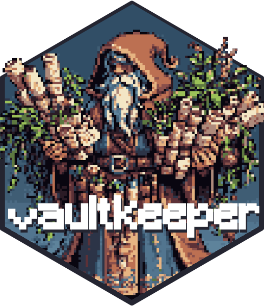

<!-- README.md is generated from README.qmd. Please edit that file -->

# vaultkeepr 

<!-- badges: start -->

[](https://CRAN.R-project.org/package=vaultkeepr)
[](https://github.com/OndrejMottl/vaultkeepr/actions/workflows/R-CMD-check.yaml)
[](https://app.codecov.io/gh/OndrejMottl/vaultkeepr?branch=main)
<!-- badges: end -->

The goal of vaultkeepr is to providing the interface to access the
[**VegVault** database](https://ondrejmottl.github.io/VegVault/).

## Installation

You can install the development version of vaultkeepr from
[GitHub](https://github.com/) with:

``` r
# install.packages("remotes")
remotes::install_github("OndrejMottl/vaultkeepr")
```
